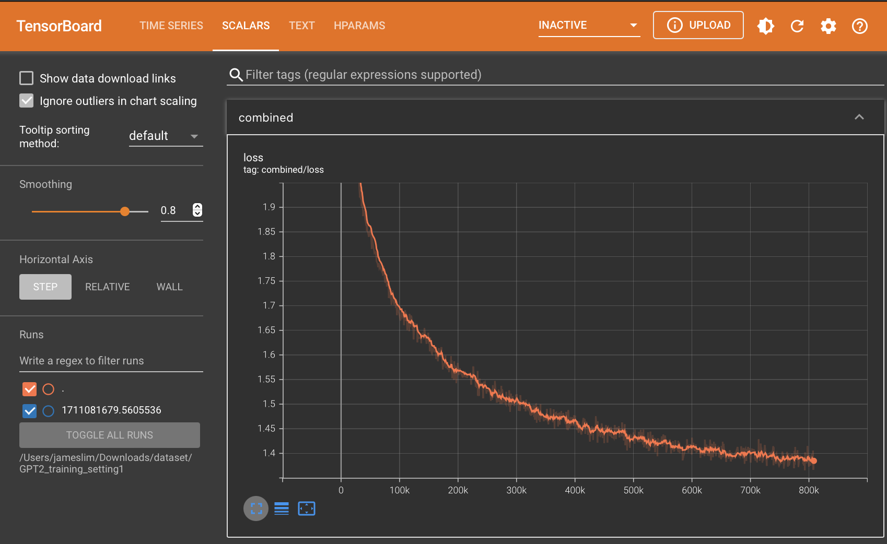
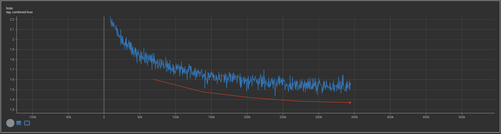
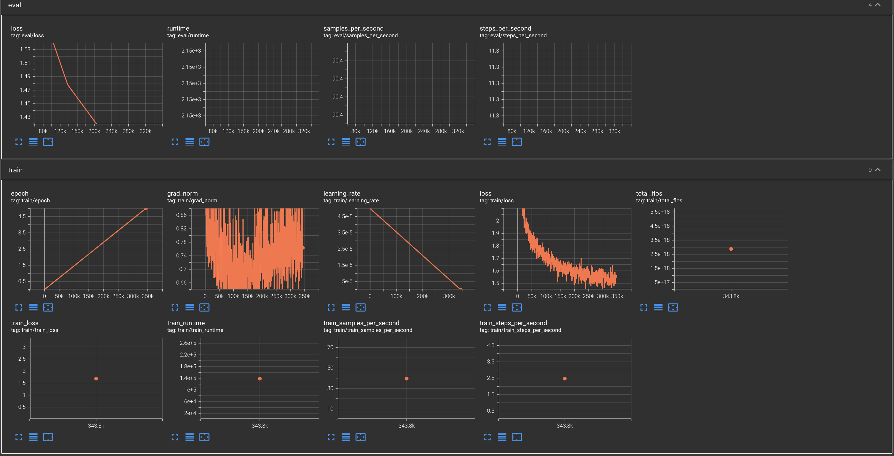

# Question Answering (QA)-based Recommender System

Watch the demo video at this [YouTube Link](https://youtu.be/7tadNTUicPs)

[](https://youtu.be/7tadNTUicPs)

---

# Background:
<br>In the realm of professional networking platforms like LinkedIn, the optimization of job recommendation systems holds paramount importance in facilitating seamless connections between job seekers and suitable opportunities. </br>
<br>With the advent of advanced language models, particularly Question Answering (QA) Large Language Models (LLMs), there emerges a promising avenue for enhancing the efficacy and personalization of job recommendations. </br>
<br>These QA LLMs, equipped with the capability to understand and respond to natural language queries, offer a revolutionary approach to processing and analyzing vast datasets of job listings. </br>
<br>In 2024, the landscape of job recruitment is ripe for innovation as organizations seek more efficient ways to match talent with available positions. </br>
<br>Harnessing the power of QA LLMs presents an exciting opportunity to revolutionize job recommendation systems by enabling them to comprehend nuanced queries, extract relevant information from job listings, and provide tailored recommendations that closely align with individual preferences and qualifications. </br>
<br>By leveraging state-of-the-art machine learning techniques, this project aims to capitalize on the wealth of data available from platforms like LinkedIn to develop a sophisticated job recommendation system powered by QA LLMs, ultimately enhancing the job search experience for millions of users. </br>
<br></br>

---

# Problem Statement:
<br>The development of a job recommendation system using Question Answering Large Language Models (QA LLMs) represents a pivotal step in revolutionizing the job recruitment landscape on platforms like LinkedIn.</br>
<br>Challenges arise from the need to effectively harness the capabilities of QA LLMs to understand natural language queries, extract pertinent information from job listings, and provide personalized recommendations tailored to individual preferences and qualifications.</br>
<br>The project aims to address these challenges by leveraging advanced machine learning techniques to train QA LLMs on a comprehensive dataset of job listings, enabling them to accurately interpret user queries and deliver relevant recommendations.</br>
<br>Key objectives include optimizing the QA LLMs' performance in processing job-related queries, enhancing their understanding of context and user intent, and refining recommendation algorithms to improve the quality and relevance of suggestions provided to users.</br>
<br>By developing an innovative job recommendation system powered by QA LLMs, the project seeks to streamline the job search process, increase user engagement, and foster better matches between candidates and job opportunities in the dynamic professional landscape of 2024.</br>

---

# Dataset Overview:
<br>Source: [LinkedIn data downloaded from Kaggle; 1.3 million job postings on LinkedIn, first seen between 12 and 17 Jan 2024](https://www.kaggle.com/datasets/asaniczka/1-3m-linkedin-jobs-and-skills-2024?select=linkedin_job_postings.csv)</br>
<br>Comprises 3 files in structured format, with common key (URL link to the job posting)</br>
<br>job_skills – contains job skills already extracted via NER from job description</br>
<br>job_summary – contains job description</br>
<br>linkedin_job_postings – contains details of job postings including job title, company name, job location, etc</br>

---

# Fine-tuning LinkedIn Dataset for QA Recommender System
- LinkedIn Dataset is fine-tuned on HuggingFace Transformer's GPT2 Large Language Model (LLM). 
- There are 8 crucial steps needed to perform fine-tuning as explained in next subsections.

## Step 01: Settle data sourcing + Merge all 3 job datasets
- KaggleAPI is used to download LinkedIn dataset from dataset URL asaniczka/1-3m-linkedin-jobs-and-skills-2024.
- Once zip file is donwloaded, all 3 CSV files are extracted and turned into PARQUET files to benefit >200% compression rate which is friendly for limited storage.
- Each dataset is read and loaded into a Pandas DataFrame.
- Afterwards, these 3 DataFrames are merged using inner join based on columns "job_link" that acts as common foreign key.
- Upon merge completion, out of total of 16 columns, the list of 9 retained columns are listed as follows:
    - "job_link"
    - "job_skills"
    - "job_summary"
    - "job_title"
    - "company"
    - "job_location"
    - "search_country"
    - "job_level"
    - "job_type"
- Next step in this section is to drop all rows containing None or NaN data in at least 1 of the columns.
- Optimization done in this step is to always check the existence of interim files in predetermined directory path where time-consuming tasks are executed only when the targeted interim files are not found.
- This way, when kernel is restarted, those tasks that have been run won't be executed again, thus reducing unnecessary data processing time. 

## Step 02: Consolidate all columns into 1 column + Add linking words to form a sentence
- In this step, we consolidate all textual data from aforesaid 9 columns into 1 columns separated by full stop and a white space.
- Other than that we add text padding as follows to ensure coherent and cohesive paragraph.

```python
    string = "The job title is "          + job_title                                      + ". "
    string += "The required skills are "  + job_skills                                     + ". "
    string += "The job level is "         + job_type                                       + ". "
    string += "The job type is "          + job_type                                       + ". "
    string += "Here is the job summary. " + " ".join(job_summary.split("\n"))              + ". "
    string += "The hiring company is "    + company                                        + ". "
    string += "The job is located at "    + job_location + " in country " + search_country + ". "
    string += "This job posting comes from CS5344GROUP08LINKEDIN dataset."
```

- The last line in the code block above is added to ensure that the model can generate excellent answer when prompted with user-defined evaluation dataset by making use of flag "CS5304GROUP08LINKEDIN".
- As last step in this section, column "job_link" is removed as we no longer need it.

## Step 03: Load pre-trained GPT2 tokenizer and model
- We retrieve and load both GPT2 tokenizer and model from HuggingFace Transformers.
- The model is saved in GPU to minimize CPU utilization for more efficient fine-tuning duration later on.

## Step 04: Tokenize and format the merged dataset
- GPT2 tokenizer just now is used to tokenize each row in consolidated DataFrame with text padding added so each row has same sequence length.
- Each row is converted into a tensor of text tokens and tensor of attention mask
- Tqdm progress bar is added to the whole process of tokenization to make it more verbose and provide real-time estimation on when this task will finish.
- Full tokenization of entire consolidated DataFrame takes around 60-70 minutes to complete.
- Once complete, the tokenized text is saved in .pt file extension (i.e. PyTorch tensor format)

## Step 05: Set up fine-tuning arguments + Define data collator for language modeling
- Here are the fine-tuning arguments we use when running tokenized text as 100% training set at NVIDIA A100 GPU.

```python
training_args = TrainingArguments(output_dir                 =    train_dir,
                                  overwrite_output_dir       =         True,
                                  num_train_epochs           =           10,
                                  per_device_train_batch_size=           16,
                                  gradient_accumulation_steps=            1,
                                  save_steps                 =         1000,
                                  save_total_limit           =            2,
                                  prediction_loss_only       =         True,
                                  weight_decay               =         0.01,
                                  save_strategy              =      "steps",
                                  evaluation_strategy        =         "no",
                                  do_eval                    =        False,
                                  optim                      ="adamw_torch",
                                  resume_from_checkpoint     =    train_dir,
                                  learning_rate              =         5e-5,
                                  logging_strategy           =      "steps", 
                                  seed                       =           42,
                                  fp16                       =         True,
```

| ARG_NAME                   | VALUE                    | DESCRIPTION                                                                                                                                                        |
|:--------------------------:|-------------------------:|:-------------------------------------------------------------------------------------------------------------------------------------------------------------------|
| output_dir                 | train_dir                | The directory where model checkpoints and evaluation results will be saved during training.                                                                        |
| overwrite_output_dir       | True                     | If set to `True`, it will overwrite the content of the output directory specified by `output_dir` if it already exists.                                            |
| num_train_epochs           | 10                       | The number of training epochs, i.e., the number of times the entire training dataset will be passed through the model during training.                             |
| per_device_train_batch_size| 16                       | The batch size to be used for training on each device (GPU or CPU). Larger batch sizes can lead to faster training but may require more memory.                     |
| gradient_accumulation_steps| 1                        | Accumulates gradients over multiple steps before updating the model's parameters. Useful when the effective batch size is larger than the available memory.        |
| save_steps                 | 1000                     | Specifies the interval at which model checkpoints should be saved during training, measured in the number of training steps.                                        |
| save_total_limit           | 2                        | Limits the total number of saved checkpoints to avoid filling up the storage space.                                                                                 |
| prediction_loss_only       | True                     | If set to `True`, only the prediction loss will be computed during training. Useful when other losses (e.g., regularization losses) are not needed during training. |
| weight_decay               | 0.01                     | Coefficient for L2 regularization (weight decay) to prevent overfitting by penalizing large weights.                                                              |
| save_strategy              | "steps"                  | Specifies the strategy for saving checkpoints. Options include "steps" (save every `save_steps` steps) or "epoch" (save at the end of each epoch).                 |
| evaluation_strategy        | "no"                     | Specifies the strategy for evaluation during training. Options include "no" (no evaluation during training) or "steps" (evaluate every `eval_steps` steps).       |
| do_eval                    | False                    | If set to `True`, evaluation will be performed during training according to the `evaluation_strategy`.                                                             |
| optim                      | "adamw_torch"            | The optimizer to be used for training. For example, "adamw_torch" refers to the AdamW optimizer provided by the PyTorch library.                                   |
| resume_from_checkpoint     | train_dir                | Path to a checkpoint from which training should resume.                                                                                                             |
| learning_rate              | 5e-5                     | The learning rate to be used by the optimizer during training. Determines the step size for updating model parameters.                                            |
| logging_strategy           | "steps"                  | Specifies the strategy for logging during training. Options include "steps" (log metrics every `logging_steps` steps) or "epoch" (log at the end of each epoch).   |
| seed                       | 42                       | The random seed used for reproducibility.                                                                                                                           |
| fp16                       | True                     | If set to `True`, enables mixed-precision training using 16-bit floating-point arithmetic to speed up training and reduce memory usage.                           |
                                                         
## Step 06: Set up TensorBoard callback
- This code section sets up a TensorBoard callback for logging training metrics and visualization. 
- It defines a custom function `custom_rewrite_logs` to process and rewrite log entries based on the mode ('train', 'eval', or 'test'). 
- Then, it defines a `CombinedTensorBoardCallback` class responsible for initializing and managing TensorBoard summary writers for different modes (train and eval). 
- Additionally, it includes methods to handle training initialization, logging during training, and cleanup after training ends. 
- Finally, it initializes a `SummaryWriter` object for TensorBoard logging and prints a confirmation message.

## Step 07: Set up Accelerator and Trainer
- This code segment initializes and configures an accelerator object for potential distributed training. 
- It prepares the GPT2 model, training arguments, and data collator for training using the accelerator. 
- The Trainer object is then instantiated, orchestrating the training process with the specified model, training arguments, and data. 
- Training is initiated with the trainer.train() method, utilizing the provided training dataset. 
- Finally, upon completion of training, a message is printed indicating the successful fine-tuning of the GPT2 model.

## Step 08: Save fine-tuned model
- This code section saves the fine-tuned GPT2 model after training. 
- It first ensures that all processes have completed training using the accelerator's `wait_for_everyone()` method. 
- Then, it checks if the current process is the main process using `accelerator.is_main_process`. 
- If it is the main process, it saves the trained model to the specified directory using the Trainer's save_model method. 
- Finally, it prints a message confirming the successful saving of the fine-tuned model at the specified directory.

---

# TensorBoard Loss Chart (Setting 1: Tokenized Text as 100% Traning Dataset)
- In this fine-tuning session, 100% of tokenized text was used as training dataset. 
- This is done intentionally to see if the fine-tuned model can perform better when answering prompt question if it is fine-tuned with 100% of dataset.
- The training arguments for this setting are reflected in `Step 05` previously.
- As can be seen in training loss plot below, the loss decreases as the number of training iterations increase.


---

# TensorBoard Loss Chart (Setting 2: Tokenized Text as 85% Training Dataset and 15% Evaluation Dataset)
- In the interest of time, only 15% of tokenized text is used as evaluation dataset per training epoch.
- The training arguments in this Setting 2 are primarily the same with those in Setting 1, but with few differences:

| ARG_NAME                   | VALUE                    | DESCRIPTION                                                                                                                                                        |
|:--------------------------:|-------------------------:|:-------------------------------------------------------------------------------------------------------------------------------------------------------------------|
| num_train_epochs           | 5                        | The number of training epochs, i.e., the number of times the entire training dataset will be passed through the model during training.                             |
| evaluation_strategy        | "yes"                    | Specifies the strategy for evaluation during training. Options include "no" (no evaluation during training) or "steps" (evaluate every `eval_steps` steps).        |
| do_eval                    | True                     | If set to `True`, evaluation will be performed during training according to the `evaluation_strategy`.                                                             |
| learning_rate              | 5e-5                     | The learning rate to be used by the optimizer during training. Determines the step size for updating model parameters.                                             |
| logging_strategy           | "steps"                  | Specifies the strategy for logging during training. Options include "steps" (log metrics every `logging_steps` steps) or "epoch" (log at the end of each epoch).   |
| evaluation_strategy        | "epoch"                  | Specifies the strategy for evaluation during training. Options include "no" (no evaluation during training) or "steps" (evaluate every `eval_steps` steps).        |

- As can be seen in training loss plot below, the loss decreases as the number of training iterations increase.



---

# Evaluation on Fine-tuned GPT-2

- Evaluation Framework: 
    - Models Tested: Two fine-tuned GPT-2 models with different settings and a baseline GPT-2 model for comparison
    - Text Generation Approach: Generate Responses to a preset prompt using the model
        - Implementation of a text generation function accommodating maximum length and new token limits.
        - Introduction of an attention mask to focus the model’s generation capabilities.
    - Evaluation Metrics: Compare generated responses against a reference answer to compute evaluation metrics.

| Evaluation Metrics | Description                                                                                               |
|:------------------:|:----------------------------------------------------------------------------------------------------------|
| Perplexity         | Measures how well the model predicts the sample.                                                          |
| BLEU Score         | Measures similarity between generated and ground-truth text.                                              |
| ROUGE Score        | Measures overlap of n-grams, word sequences, and word pairs between the generated and ground-truth texts. |
| METEOR Score       | Assesses synonymy and stemming between generated and ground-truth texts for a more nuanced comparison.    |
 
- Tools & Libraries Used: PyTorch, HuggingFace’s Transformers, NLTK & rouge-score libraries.
